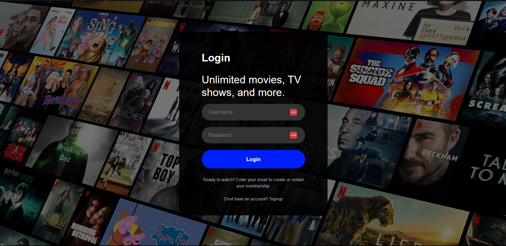
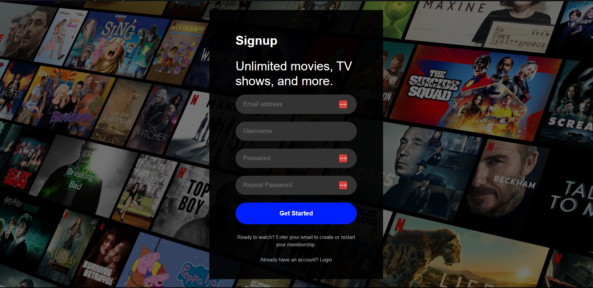
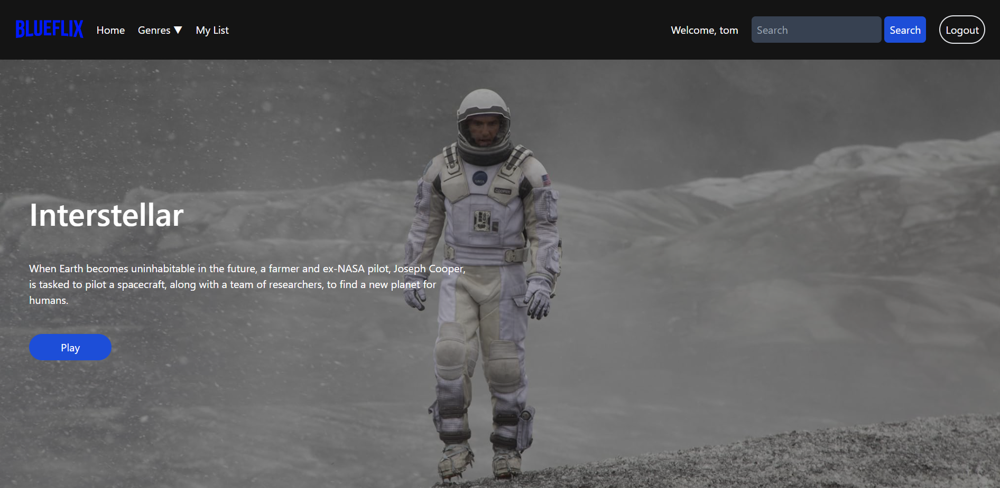
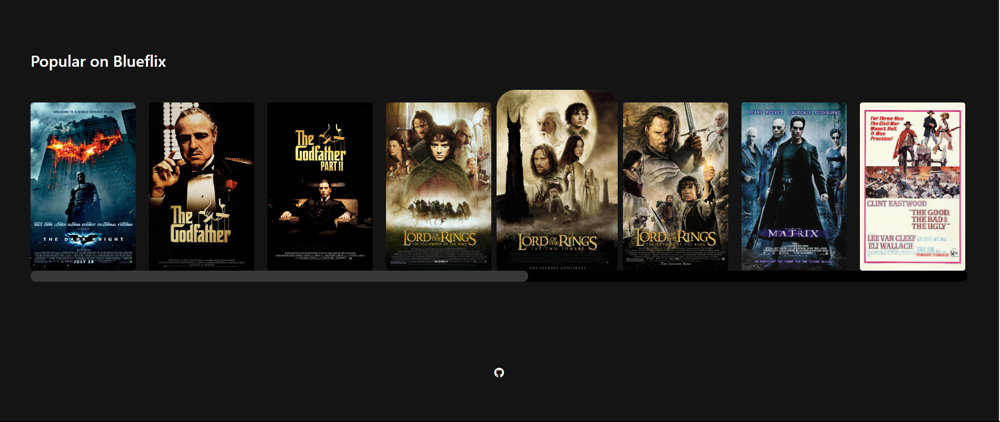
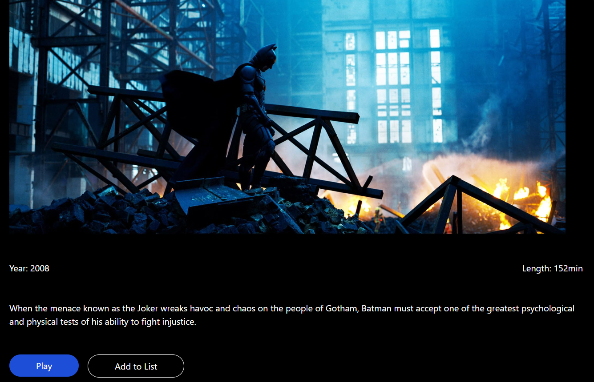
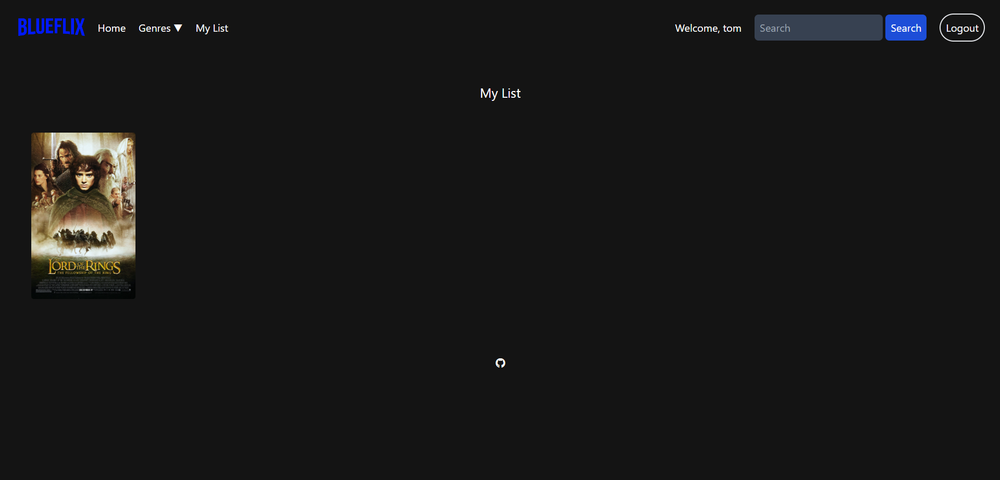
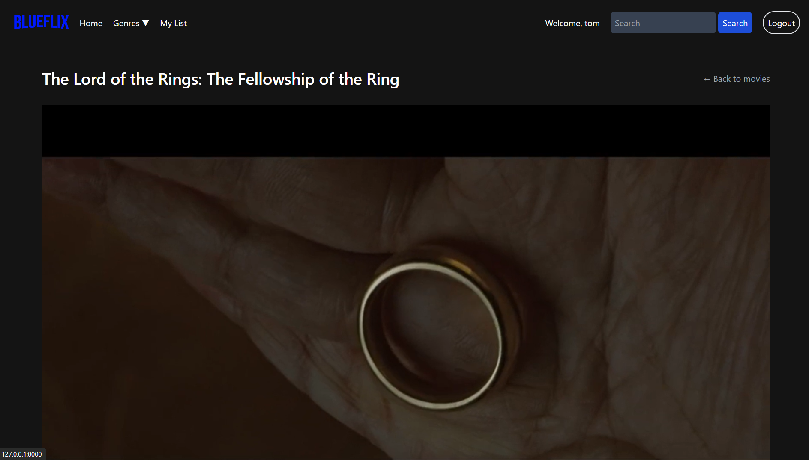
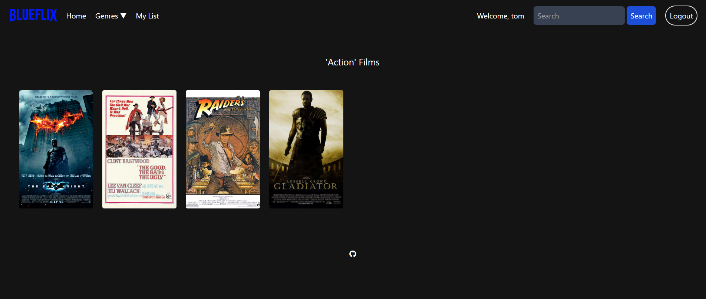
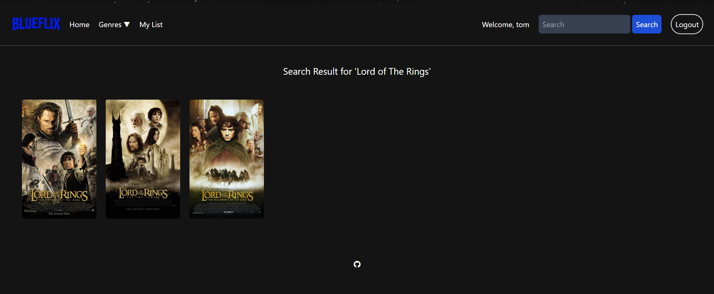

## Introduction

Blueflix is a website inspired by Netflix, developed as the Final Project for CS50 Web. Blueflix is a platform where users can register, browse their favorite movies, access information about them, filter by genre, or search directly. Additionally, users can add movies to their watchlist for later viewing.

## Distinctiveness and Complexity

Blueflix strives to apply all the concepts developed in the CS50W course. It distinguishes itself from other implemented projects because it attempts to implement something new based on an existing web application: 'Netflix'. As a movie platform, its proposal is to simulate and provide an experience similar to that offered by the streaming service it is inspired by, albeit with the technical limitations of the developer (myself).

As one of the requirements for the Final Project, we used Django, including some models in the Back-End, and, of course, we used JavaScript in our Front-End. Additionally, I made every effort to make this project as mobile-responsive as possible.

However, it is worth noting that this is still a project in development, as I continue to learn new skills and further solidify my knowledge, I will continue to review and improve the project even more.

Therefore, Blueflix is a project that dreams and will continue to dream big, as long as its creator continues to develop and further enhance his set of skills.

## Deployment

### link

## Technologies

- Django
- Python
- PostgreSQL
- JavaScript
- HTML
- CSS
- Bootstrap 5
- Tailwind

## Installation

- Clone / fork this repository.
- Create a virtual enviroment for your local financeer directory.
- Install the required libraries that are listed in [requirements.txt](requirements.txt).
- Run the application:

```
$ python run.py
```
- Enjoy ;)

## Features

### Login / Sign Up page:




Users have to create an account prior to using this application. They can register by providing an email, username, and password.

### Index:




On this page, users have a view of the featured movie and the available catalog of movies.

### Movie modal:




By clicking on a movie, users will be able to see a modal with some details such as duration, release year, and a brief description of the movie. Additionally, there are two available options: 'Add to list' and 'Play'.

### My List:



All movies added to the watchlist go to the 'My List' page.

### Movie:



Clicking on play, we are directed to the specific movie page. Here, we have a player with a trailer of the movie in question and a brief synopsis of the feature film.

### Genres:



It is possible to filter the movies by genre. We can simply select a specific category, and thus, we will have as a result a list of all possible movies for that particular genre.

### Search:



With the search bar, we can look for specific titles. Type in the keywords or just a small excerpt of the title, and there will be a list of selected works.

## Conclusion

This documentation provides an overview of Blueflix, its features, and the technologies used. Feel free to explore the codebase and contribute to the project. Thank you for your interest in Blueflix.